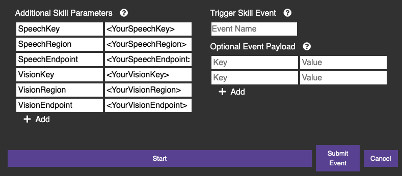

# Cognitive Services Example

*This example was last tested on `robotVersion 1.13.0.10362`.*

An example skill to show how you can use Microsoft's Cognitive Services.

**Important:** You must [create a Speech Service and Vision Service with Azure Cognitive Services](https://docs.microsoft.com/en-us/azure/cognitive-services/cognitive-services-apis-create-account?tabs=multiservice%2Cwindows) before you run this skill. Then, the **first** time you start the skill, you must submit the key, region, and endpoint for your services as startup parameters in the [Skill Runner](http://sdk.mistyrobotics.com/skill-runner/index.html).  Click on the gear icon next to the skill name that appears in the **Manage** section once the skill is deployed to the robot. Add the key/value pairs below to the Additional Skill Parameters for your auth.

* `SpeechKey`
* `SpeechRegion`
* `SpeechEndpoint`
* `VisionKey`
* `VisionRegion`
* `VisionEndpoint`

You can find these values under the **Overview** tab for each service. For example:


Your additional skill parameters should look like this:



Misty saves these values, so you only need to send these parameters the first time you run the skill.

**Important:** For this example skill, these auth settings are stored in a **readable and unencrypted** file on the robot. You can update this as needed, but this should get you going!

## Setting the optional fields

The following are additional optional fields that you can set in the startup parameters when you run the skill. Additionally, you change these fields by issuing a request to the API endpoint calls to the "Update" event (see [Updating the optional fields](./#updating-the-optional-fields) below).

* `volume` `0` - `100`
* `defaultvoice` = default is `"en-AU-HayleyRUS"`
* `fromdefaultlanguage` = default `"en-US"`
* `todefaultlanguage` = default `"en"`
* `foreignvoice` = default is `"es-MX-Raul-Apollo"`
* `fromforeignlanguage` = default is `"en-US"`
* `toforeignlanguage` = default is `"es-MX"`
* `profanitysetting` = `raw`, `removed`, `masked` - default `raw` (allows cursing)

You can find the language and voice options for some of these fields in the documentation at: 
https://docs.microsoft.com/en-us/azure/cognitive-services/speech-service/language-support

## Once running...

- Pushing Misty's front right bumper (from her perspective) has Misty take a picture, display it on the screen, and describe it using the Vision Service API.
- Pushing Misty's front left bumper has Misty beep (to tell the user to start recording), record for 5 seconds, and then process the audio file to have Misty read back what you said (using Cognitive Services to translate the speech into text, and reading the text with the selected voice).
- Pushing Misty's back left bumper has Misty beep (to tell the user to start recording), record for 5 seconds, and then process the audio file with Cognitive Services to have Misty read back what you said in a different language. The skill defaults to Spanish, but you can change the language that Misty tranlates to and from by adjusting the `toforeignlanguage` and `fromforeignlanguage` parameters on startup or by sending REST call to the "Update" event.
- Pushing Misty's back right bumper turns face recognition on and off. When it is on, if Misty sees a face she knows, she says, "Hi". If she sees a face that she doesn't know, she takes a picture and describes it using the Vision Service API.

## Updating the optional fields

You can send user triggered events as REST commands to call events, update the default voice and translation languages, and change the other [optional fields listed above](./#setting-the-optional-fields).

You an trigger an event via REST by sending a request to the [`TriggerSkillEvent`](https://docs.mistyrobotics.com/misty-ii/rest-api/api-reference/#triggerskillevent) endpoint in Postman, the [API Explorer](http://sdk.mistyrobotics.com/api-explorer/index.html), or any other tool for sending REST requests.

The endpoint for the [`TriggerSkillEvent`]() operation is: 

POST `<robot_ip>/api/skills/event`

You must use a content type of JSON for the payload body. The event options for this skill are:

```
//Describe the scene
{
 	"Skill": "ed3c8500-8d2c-44f6-835a-e74695f6a028",
 	"EventName": "Describe",
	"Payload" : {
 	}
 }

//Listen and repeat
{
 	"Skill": "ed3c8500-8d2c-44f6-835a-e74695f6a028",
 	"EventName": "Repeat",
	"Payload" : {
 	}
 }

//Update settings payload example, you can set any of the optional fields shown above, but you cannot change auth at runtime 
 {
 	"Skill": "ed3c8500-8d2c-44f6-835a-e74695f6a028",
 	"EventName": "Update",
	"Payload" : {
		"DefaultVoice": "en-US-BenjaminRUS"
 	}
 }

//Listen and translate
{
 	"Skill": "ed3c8500-8d2c-44f6-835a-e74695f6a028",
 	"EventName": "Translate",
	"Payload" : {
 	}
 }

//Text to Speech
{
 	"Skill": "ed3c8500-8d2c-44f6-835a-e74695f6a028",
 	"EventName": "Speak",
	"Payload" : {
		"Text": "What to say."
 	}
 }
```


---

*Copyright 2020 Misty Robotics*<br>
*Licensed under the Apache License, Version 2.0*<br>
*http://www.apache.org/licenses/LICENSE-2.0*